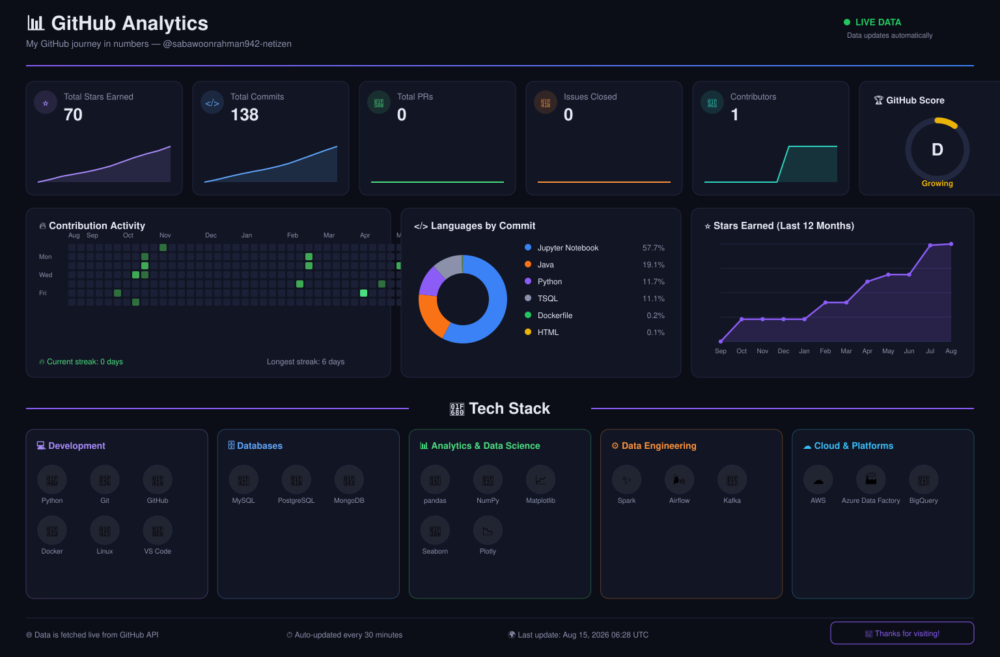

# 📊 GitHub Analytics

This dashboard is **not a static image** — a GitHub Action in this repo
(`.github/workflows/update-dashboard.yml`) pulls fresh data from the
GitHub API every 6 hours (and on every push) and regenerates the SVG
below, so anyone viewing this README always sees near‑real‑time stats.

  

---

### ⚙️ How it works

1. `scripts/fetch_stats.py` calls the GitHub GraphQL/REST API for this
   account and writes `data.json`.
2. `scripts/generate_svg.py` turns `data.json` into
   `assets/dashboard.svg`, styled like a dark analytics dashboard.
3. The workflow commits the refreshed files back to this repo on a
   schedule, so the image above is always current.

### 🔑 One-time setup you need to do

1. Create a **Personal Access Token** (classic or fine‑grained) with
   `read:user` and `public_repo` scopes.
2. In this repo go to **Settings → Secrets and variables → Actions**
   and add it as a secret named `STATS_TOKEN`.
3. Go to the **Actions** tab and run "Update GitHub Analytics
   Dashboard" once manually (`workflow_dispatch`) to generate the
   first image.

That's it — from then on it refreshes itself automatically.
